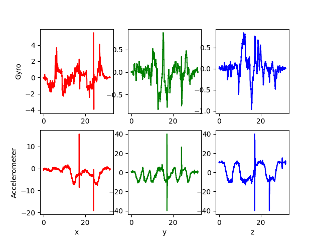
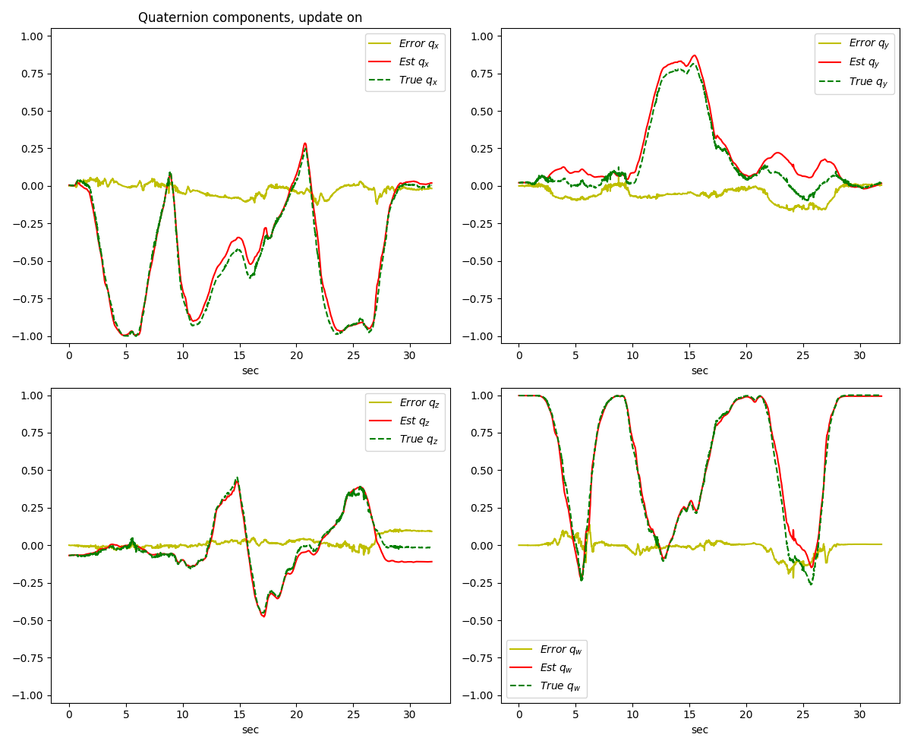
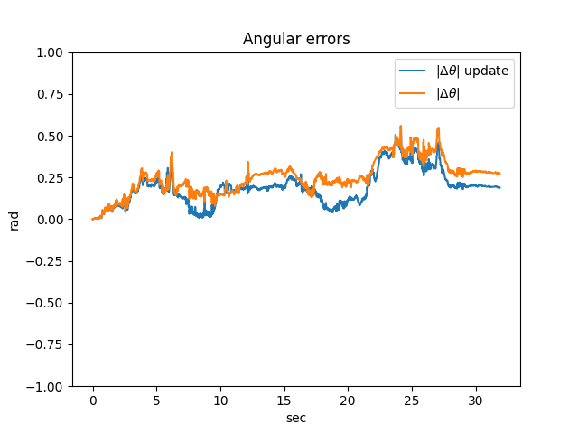
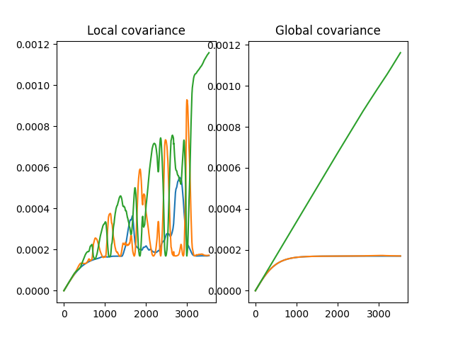
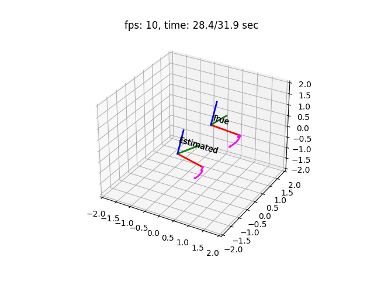

# quaternion_eskf
Orientation estimation using quaternions and the Error State Kalman Filter (ESKF). For detailed explanation of the implementation, see quaternion_eskf.pdf.

## Run the ESKF

    python3 main.py <dataset> [--update]

where \<dataset\> is (1-6, or custom). Adding the --update option will enable the update step. 

- Sensor data will be plotted, and sensor mean and average will be printed. Close window to continue.

    

- Quaternion components (true, estimated, error), angular errors and diagonal components of (local/global) covariance will be plotted. The quaternion components will be shown with the update step if  the --update option is given. Angular errors is shown with and without the update step if the --update option is given. Close windows to continue.

    
     
    

- A 3D visualization will be displayed, with the estimated and true orientation. 

    